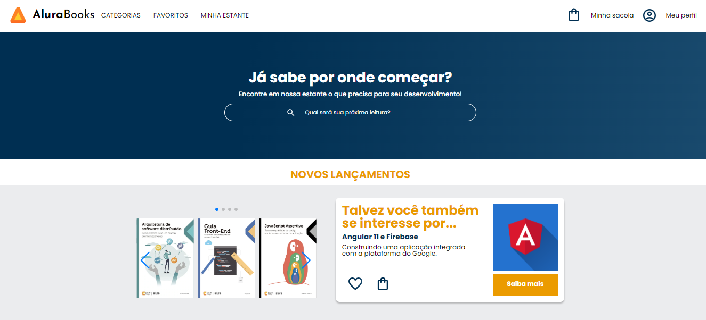

<h1 align="center"> Projeto_AluraBooks :books: </h1>

  <a href="#-tecnologias">Tecnologias</a>&nbsp;&nbsp;&nbsp;&nbsp;&nbsp;&nbsp;

 

  
  
  

## 🚀 Tecnologias

- HTML e CSS
- Git e Github

## 💻 Projeto

Projeto feito durante o curso de HTML e CSS: responsividade com mobile-first da Alura no Programa Desenvolve 2024 | Grupo Boticário 

## :memo: Licença

Esse projeto está sob a licença MIT.

---
  Desenvolvido por Thais Mabelli [Programa Desenvolve 2024 | Grupo Boticário]